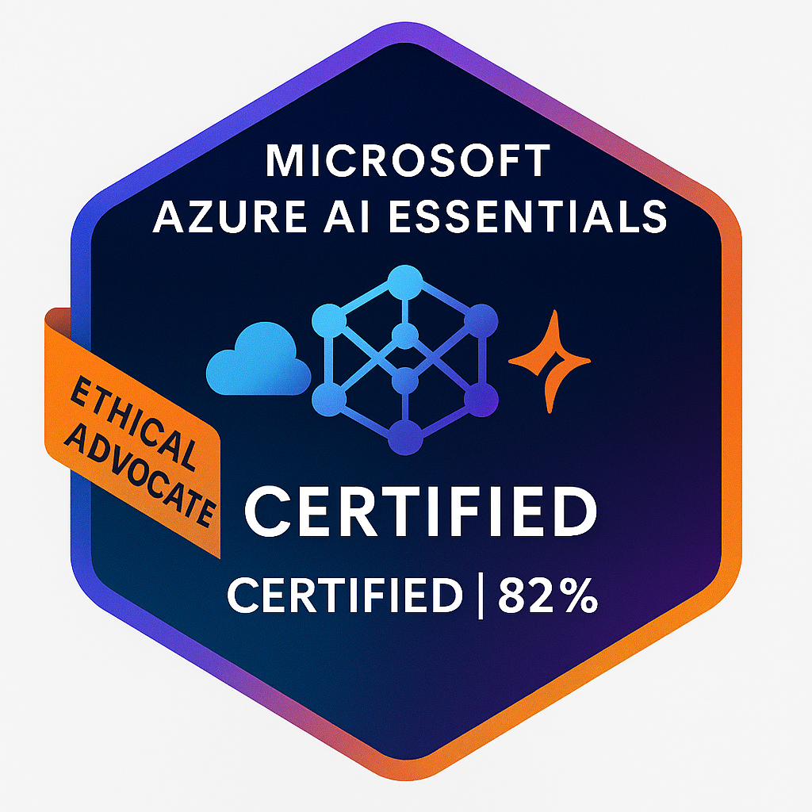

# 🚀 Leonard Phokane — Ethical AI Technologist & Full-Stack Developer

Welcome to my portfolio — a modular showcase of my journey as a certified AI associate, DevOps architect, and Afro-futurist technologist. I build legacy-driven platforms that blend ethical innovation with recruiter-facing clarity.

---

## 👤 About Me

I'm a BSc IT graduate, Oracle & Microsoft-certified AI associate, and founder of UbuntuFlow (formerly ZuluTech). My work spans real-time apps, recruiter automation workflows, and open-source storytelling. I believe in building tech that empowers communities and reflects cultural identity.

---

## 🧠 AI Certifications & Learning Journey

As an Oracle and Microsoft-certified AI associate, I bring a strong foundation in cloud-native development, ethical deployment, and generative AI workflows. My learning journey reflects a commitment to responsible technology and Afro-futurist innovation.

### ✅ Certifications

  
  

  <strong>Microsoft Azure AI Essentials</strong> — Scored 82% | Certified in ethical AI, model evaluation, and Azure ML workflows.  
   
  <strong>Oracle AI Foundations Associate</strong> — Certified in OCI AI lifecycle, responsible deployment, and automation.

### 📚 Currently Enrolled

- **AI Literacy & Generative AI Courses**  
  - *Otermans Institute*: Exploring AI ethics, accessibility, and global impact.  
  - *NVIDIA Deep Learning Institute*: Hands-on with neural networks, model optimization, and real-world deployment.

> “From village chalkboards to fairness algorithms, my story is proof that purpose fuels progress and code becomes legacy.” — Leonard Phokane

---

## 💼 Projects

Here are some featured projects that reflect my technical depth and creative direction:

- 🐾 **Digital Pet** — Interactive web-based pet simulation using JavaScript and modular logic.
- 🌸 **Iris Flower Classifier** — Decision Tree Classifier using Scikit-learn to predict species from petal/sepal data.
- 🛒 **E-commerce Database Design** — Relational schema for scalable online store with normalized tables and optimized queries.
- 💸 **Send Money App** — Peer-to-peer payment interface with secure transaction logic.
- ☁️ **Cloud Deployment Stack** — EC2, IIS, and Security Groups for scalable backend infrastructure.
- 📧 **Email Archival System** — AWS Lambda + SES + S3 pipeline for automated email storage.
- ⚖️ **Fairness Inspector** — Bias detection tool for ethical AI model evaluation.
- 💬 **Real-Time Chat App** — Socket.io-based messaging with live user presence.
- 🌍 **Kazilink Project** — Geo-tagged music sharing platform, Vibe Hackathon finalist.
- 🤖 **Jobat Recruiter Automation** — Resume parsing, badge matching, and outreach workflows.

---

## 🛠️ Skills & Programming Languages

- **Languages:** JavaScript, Python, SQL, HTML/CSS, Bash
- **DevOps:** CI/CD, Git, .env security, deployment automation
- **Design:** Responsive UI/UX, grid layouts, AOS.js animations, Canva pitch decks
- **AI Tools:** Azure AI Studio, OCI AI, NVIDIA DLI, Copilot, ChatGPT, Padlet AI

---

## 🧰 Frameworks & Tools

- **Frontend:** React.js, Tailwind CSS, AOS.js
- **Backend:** Node.js, Express.js, Socket.io
- **Cloud & DevOps:** AWS (EC2, Lambda, S3), Azure, Oracle Cloud, GitHub Actions
- **Design & Branding:** Canva, Figma, Markdown, Carousel Layouts

---

## 📬 Contact Me

- 📧 Email: [leonardphokane1@gmail.com](mailto:leonardphokane1@gmail.com)  
- 🌐 Portfolio: [MY PORTFOLIO](https://leonardphokane.github.io/leonardphokane-portfolio/)  
- 💼 LinkedIn: [linkedin.com/in/leonardphokane](https://linkedin.com/in/leonardphokane)  
- 🐙 GitHub: [github.com/leonardphokane](https://github.com/leonardphokane)

---

> Built with legacy in mind. Powered by Ubuntu. Driven by impact.
